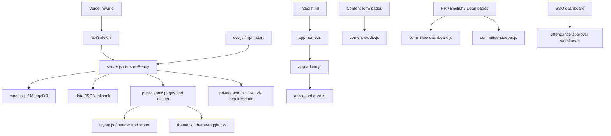

# Project audit and dependency map

Captured before edits: `9bd35a9dd8ac58ff7827462c813be6ebbf68d15b`. Git status: **clean**. Branch: `feature/site-analytics-and-dashboard-updates`.

## Runtime relationships

## File inventory

The table covers all 86 tracked project files. Installed `node_modules/`, Git metadata, Vercel metadata, and ignored environment/account files are runtime/tooling inputs, not cleanup candidates. Environment and credential contents were not read. The existing spreadsheet and session-named JSON file are retained because no evidence establishes they are disposable.

### project-support

| File | Bytes | Lines |
|---|---:|---:|
| `.gitignore` | 112 | ? |
| `docs/BACKUP_PLAN.md` | 7810 | ? |
| `docs/GOOGLE_SIGN_IN_SETUP.md` | 1367 | ? |
| `miu project new.xlsx` | 8433 | ? |
| `ses_ef1f566b3ffeoidtt4pcccgrzg.json` | 2499 | ? |
| `tests/verify-structure.js` | 5465 | 115 |

### protected-backend-data-config

| File | Bytes | Lines |
|---|---:|---:|
| `api/index.js` | 161 | 8 |
| `data/audit-logs.json` | 366 | ? |
| `data/club-views.json` | 22 | ? |
| `data/clubs.json` | 19767 | ? |
| `data/event-views.json` | 23 | ? |
| `data/homepage.json` | 117 | ? |
| `dev.js` | 1220 | 43 |
| `models.js` | 16948 | 329 |
| `package-lock.json` | 54683 | ? |
| `package.json` | 633 | ? |
| `scripts/backup-worker.env.example` | 620 | ? |
| `scripts/database-backup-worker.js` | 13101 | 263 |
| `scripts/restore-database-backup.js` | 2972 | 66 |
| `scripts/xlsx-writer.js` | 10636 | 137 |
| `seed.js` | 14650 | 398 |
| `server.js` | 205498 | 4477 |
| `vercel.json` | 81 | ? |

### frontend-source

| File | Bytes | Lines |
|---|---:|---:|
| `private/admin-club-credentials.html` | 4286 | 91 |
| `private/global-admin.html` | 51335 | 827 |
| `public/404.html` | 1551 | 31 |
| `public/500.html` | 1927 | 33 |
| `public/assets/css/base.css` | 55525 | 1894 |
| `public/assets/css/dark.css` | 17771 | 253 |
| `public/assets/css/event-modal.css` | 2797 | 114 |
| `public/assets/css/features.css` | 42443 | 333 |
| `public/assets/css/pages/events.css` | 6641 | 307 |
| `public/assets/css/responsive.css` | 4154 | 255 |
| `public/assets/css/theme-toggle.css` | 1097 | 47 |
| `public/assets/js/admin-data-status.js` | 3122 | 67 |
| `public/assets/js/app-admin.js` | 45588 | 948 |
| `public/assets/js/app-dashboard.js` | 37228 | 848 |
| `public/assets/js/app-home.js` | 51912 | 1097 |
| `public/assets/js/attendance-approval-workflow.js` | 8875 | 193 |
| `public/assets/js/attendance-checkin.js` | 3031 | 67 |
| `public/assets/js/attendance-dashboard.js` | 10640 | 233 |
| `public/assets/js/committee-attendance.js` | 7977 | 182 |
| `public/assets/js/committee-dashboard.js` | 50776 | 1011 |
| `public/assets/js/committee-sidebar.js` | 7858 | 173 |
| `public/assets/js/content-studio.js` | 11514 | 259 |
| `public/assets/js/event-modal.js` | 3457 | 77 |
| `public/assets/js/layout.js` | 6844 | 163 |
| `public/assets/js/member-directory.js` | 8704 | 184 |
| `public/assets/js/pages/booths.js` | 4981 | 112 |
| `public/assets/js/pages/event-detail.js` | 3865 | 84 |
| `public/assets/js/pages/events.js` | 6215 | 149 |
| `public/assets/js/pages/sponsors.js` | 4156 | 97 |
| `public/assets/js/theme.js` | 2562 | 55 |
| `public/attendance.html` | 2419 | 43 |
| `public/components/site-footer.html` | 703 | 12 |
| `public/components/site-header.html` | 3802 | 54 |
| `public/dashboards/dean-dashboard.html` | 17987 | 178 |
| `public/dashboards/english-dashboard.html` | 10751 | 115 |
| `public/dashboards/pr-dashboard.html` | 14932 | 154 |
| `public/dashboards/sso-dashboard.html` | 3603 | 46 |
| `public/index.html` | 51002 | 867 |
| `public/pages/applicant-login.html` | 8795 | 148 |
| `public/pages/booth-form.html` | 9031 | 152 |
| `public/pages/booths.html` | 2861 | 60 |
| `public/pages/club-content.html` | 6778 | 112 |
| `public/pages/event-form.html` | 8101 | 148 |
| `public/pages/event.html` | 2860 | 55 |
| `public/pages/events.html` | 3830 | 80 |
| `public/pages/feed-form.html` | 7616 | 140 |
| `public/pages/forgot-password.html` | 3867 | 82 |
| `public/pages/reset-password.html` | 5204 | 103 |
| `public/pages/sponsor-form.html` | 10265 | 180 |
| `public/pages/sponsors.html` | 2817 | 59 |

### frontend-asset

| File | Bytes | Lines |
|---|---:|---:|
| `public/assets/img/pics/Utopia.jpg` | 38707 | ? |
| `public/assets/img/pics/acpc.jpg` | 60502 | ? |
| `public/assets/img/pics/cdc.jpg` | 17326 | ? |
| `public/assets/img/pics/dimas.jpg` | 36642 | ? |
| `public/assets/img/pics/gamerslegacy.jpg` | 54850 | ? |
| `public/assets/img/pics/ieee.jpg` | 126834 | ? |
| `public/assets/img/pics/ihepc.jpg` | 72568 | ? |
| `public/assets/img/pics/logo.svg.png` | 42084 | ? |
| `public/assets/img/pics/msp.jpg` | 48180 | ? |
| `public/assets/img/pics/mun.jpg` | 163249 | ? |
| `public/assets/img/pics/tedx.jpg` | 45389 | ? |
| `public/assets/img/pics/theater.jpg` | 72740 | ? |
| `public/assets/img/pics/tuners.jpg` | 104423 | ? |

## Page dependencies (original order)

### `private/admin-club-credentials.html`

Styles and linked assets: `/assets/css/base.css?v=20261009b` ? `/assets/css/responsive.css?v=20261009b` ? `/assets/css/dark.css?v=20261009c` ? `/assets/css/features.css?v=20261009b` ? `/assets/img/pics/logo.svg.png`.

Scripts: `src="/assets/js/layout.js?v=11" defer` ? `src="/assets/js/theme.js?v=20261009c" defer` ? inline (1224 bytes).

### `private/global-admin.html`

Styles and linked assets: `/assets/css/base.css?v=20261009e` ? `/assets/css/responsive.css?v=20261009b` ? `/assets/css/dark.css?v=20261009c` ? `/assets/css/features.css?v=20261009b` ? `/assets/img/pics/logo.svg.png`.

Scripts: `src="/assets/js/layout.js?v=11" defer` ? `src="/assets/js/theme.js?v=20261009c" defer` ? inline (27145 bytes).

### `public/404.html`

Styles and linked assets: `/assets/css/dark.css?v=20261009c`.

Scripts: `src="/assets/js/theme.js?v=20261009c" defer`.

### `public/500.html`

Styles and linked assets: `/assets/css/dark.css?v=20261009c`.

Scripts: `src="/assets/js/theme.js?v=20261009c" defer`.

### `public/attendance.html`

Styles and linked assets: `/assets/css/base.css?v=20261009h` ? `/assets/css/responsive.css?v=20261006e` ? `/assets/css/dark.css?v=20261009c`.

Scripts: `src="/assets/js/layout.js?v=11" defer` ? `src="/assets/js/attendance-checkin.js?v=7" defer` ? `src="/assets/js/theme.js?v=20261009c" defer`.

### `public/components/site-footer.html`

Styles and linked assets: none.

Scripts: none.

### `public/components/site-header.html`

Styles and linked assets: none.

Scripts: none.

### `public/dashboards/dean-dashboard.html`

Styles and linked assets: `https://fonts.googleapis.com/css2?family=Inter:wght@400;500;600;700;800;900&display=swap` ? `/assets/css/base.css?v=20261007d` ? `/assets/css/responsive.css?v=20261005h` ? `/assets/css/dark.css?v=20261009c` ? `/assets/css/features.css?v=20261009au` ? `/assets/img/pics/logo.svg.png`.

Scripts: `src="/assets/js/committee-sidebar.js?v=13"` ? `src="/assets/js/committee-dashboard.js?v=20261009ac"` ? `src="/assets/js/committee-attendance.js?v=6"` ? `src="/assets/js/attendance-approval-workflow.js?v=9"` ? `src="/assets/js/layout.js?v=11" defer` ? `src="/assets/js/theme.js?v=20261009c" defer`.

### `public/dashboards/english-dashboard.html`

Styles and linked assets: `https://fonts.googleapis.com/css2?family=Inter:wght@400;500;600;700;800;900&display=swap` ? `/assets/css/base.css?v=20261007d` ? `/assets/css/responsive.css?v=20261005h` ? `/assets/css/dark.css?v=20261009c` ? `/assets/css/features.css?v=20261009au` ? `/assets/img/pics/logo.svg.png`.

Scripts: `src="/assets/js/committee-sidebar.js?v=13"` ? `src="/assets/js/committee-dashboard.js?v=20261009ac"` ? `src="/assets/js/layout.js?v=11" defer` ? `src="/assets/js/theme.js?v=20261009c" defer`.

### `public/dashboards/pr-dashboard.html`

Styles and linked assets: `https://fonts.googleapis.com/css2?family=Inter:wght@400;500;600;700;800;900&display=swap` ? `/assets/css/base.css?v=20261008l` ? `/assets/css/responsive.css?v=20261005h` ? `/assets/css/dark.css?v=20261009c` ? `/assets/css/features.css?v=20261009au` ? `/assets/img/pics/logo.svg.png`.

Scripts: `src="/assets/js/committee-sidebar.js?v=13"` ? `src="/assets/js/committee-dashboard.js?v=20261009ac"` ? `src="/assets/js/member-directory.js?v=20261009y"` ? `src="/assets/js/committee-attendance.js?v=6"` ? `src="/assets/js/attendance-approval-workflow.js?v=9"` ? `src="/assets/js/layout.js?v=11" defer` ? `src="/assets/js/theme.js?v=20261009c" defer`.

### `public/dashboards/sso-dashboard.html`

Styles and linked assets: `/assets/css/base.css?v=20261009e` ? `/assets/css/responsive.css?v=20261009b` ? `/assets/css/dark.css?v=20261009c` ? `/assets/css/features.css?v=20261009au` ? `/assets/img/pics/logo.svg.png`.

Scripts: `src="/assets/js/committee-sidebar.js?v=13"` ? `src="/assets/js/attendance-approval-workflow.js?v=9"` ? `src="/assets/js/layout.js?v=11" defer` ? `src="/assets/js/theme.js?v=20261009c" defer`.

### `public/index.html`

Styles and linked assets: `https://fonts.googleapis.com` ? `https://fonts.gstatic.com` ? `https://fonts.googleapis.com/css2?family=Inter:wght@400;500;600;700;800;900&display=swap` ? `/assets/css/base.css?v=20261009q` ? `/assets/css/responsive.css?v=20261006e` ? `/assets/css/dark.css?v=20261009c` ? `/assets/css/features.css?v=20261009aj` ? `/assets/css/event-modal.css?v=3` ? `/assets/img/pics/logo.svg.png`.

Scripts: inline (135 bytes) ? `src="/assets/js/event-modal.js?v=2"` ? `src="/assets/js/committee-sidebar.js?v=13"` ? `src="/assets/js/app-home.js?v=20261009ab"` ? `src="/assets/js/app-admin.js?v=20261009c"` ? `src="/assets/js/app-dashboard.js?v=20261009x"` ? `src="/assets/js/admin-data-status.js?v=2" defer` ? `src="https://cdn.jsdelivr.net/npm/qrcodejs@1.0.0/qrcode.min.js" defer` ? `src="/assets/js/attendance-dashboard.js?v=13" defer` ? `src="/assets/js/member-directory.js?v=20261009s"` ? `src="/assets/js/layout.js?v=11" defer` ? `src="/assets/js/theme.js?v=20261009c" defer`.

### `public/pages/applicant-login.html`

Styles and linked assets: `https://fonts.googleapis.com/css2?family=Inter:wght@400;500;600;700;800;900&display=swap` ? `/assets/css/base.css?v=20261007d` ? `/assets/css/responsive.css?v=20261005h` ? `/assets/css/dark.css?v=20261009c` ? `/assets/css/features.css?v=20261008g` ? `/assets/img/pics/logo.svg.png`.

Scripts: inline (4043 bytes) ? `src="/assets/js/layout.js?v=11" defer` ? `src="/assets/js/theme.js?v=20261009c" defer`.

### `public/pages/booth-form.html`

Styles and linked assets: `https://fonts.googleapis.com/css2?family=Inter:wght@400;500;600;700;800;900&display=swap` ? `/assets/css/base.css?v=20261007d` ? `/assets/css/responsive.css?v=20261005i` ? `/assets/css/dark.css?v=20261009c` ? `/assets/css/features.css?v=20261005i` ? `/assets/img/pics/logo.svg.png`.

Scripts: `src="/assets/js/content-studio.js?v=20261007c"` ? inline (2019 bytes) ? `src="/assets/js/layout.js?v=11" defer` ? `src="/assets/js/theme.js?v=20261009c" defer`.

### `public/pages/booths.html`

Styles and linked assets: `https://fonts.googleapis.com` ? `https://fonts.gstatic.com` ? `https://fonts.googleapis.com/css2?family=Inter:wght@400;500;600;700;800;900&display=swap` ? `/assets/css/base.css?v=20261007d` ? `/assets/css/responsive.css?v=20261005h` ? `/assets/css/dark.css?v=20261009c` ? `/assets/css/features.css?v=20261008g` ? `/assets/css/pages/events.css?v=13` ? `/assets/css/event-modal.css?v=2` ? `/assets/img/pics/logo.svg.png`.

Scripts: `src="/assets/js/pages/booths.js?v=2"` ? `src="/assets/js/layout.js?v=11" defer` ? `src="/assets/js/theme.js?v=20261009c" defer`.

### `public/pages/club-content.html`

Styles and linked assets: `https://fonts.googleapis.com/css2?family=Inter:wght@400;500;600;700;800;900&display=swap` ? `/assets/css/base.css?v=20261007d` ? `/assets/css/responsive.css?v=20261005i` ? `/assets/css/dark.css?v=20261009c` ? `/assets/css/features.css?v=20261005i` ? `/assets/img/pics/logo.svg.png`.

Scripts: `src="/assets/js/content-studio.js?v=20261007c"` ? inline (145 bytes) ? `src="/assets/js/layout.js?v=11" defer` ? `src="/assets/js/theme.js?v=20261009c" defer`.

### `public/pages/event-form.html`

Styles and linked assets: `https://fonts.googleapis.com/css2?family=Inter:wght@400;500;600;700;800;900&display=swap` ? `/assets/css/base.css?v=20261007d` ? `/assets/css/responsive.css?v=20261005i` ? `/assets/css/dark.css?v=20261009c` ? `/assets/css/features.css?v=20261005i` ? `/assets/img/pics/logo.svg.png`.

Scripts: `src="/assets/js/content-studio.js?v=20261007c"` ? inline (1500 bytes) ? `src="/assets/js/layout.js?v=11" defer` ? `src="/assets/js/theme.js?v=20261009c" defer`.

### `public/pages/event.html`

Styles and linked assets: `https://fonts.googleapis.com` ? `https://fonts.gstatic.com` ? `https://fonts.googleapis.com/css2?family=Inter:wght@400;500;600;700;800;900&display=swap` ? `/assets/css/base.css?v=20261007d` ? `/assets/css/responsive.css?v=20261006a` ? `/assets/css/dark.css?v=20261009c` ? `/assets/css/features.css?v=20261005h` ? `/assets/css/pages/events.css?v=12` ? `/assets/img/pics/logo.svg.png`.

Scripts: `src="/assets/js/pages/event-detail.js?v=2"` ? `src="/assets/js/layout.js?v=11" defer` ? `src="/assets/js/theme.js?v=20261009c" defer`.

### `public/pages/events.html`

Styles and linked assets: `https://fonts.googleapis.com` ? `https://fonts.gstatic.com` ? `https://fonts.googleapis.com/css2?family=Inter:wght@400;500;600;700;800;900&display=swap` ? `/assets/css/base.css?v=20261007d` ? `/assets/css/responsive.css?v=20261006a` ? `/assets/css/dark.css?v=20261009c` ? `/assets/css/features.css?v=20261008g` ? `/assets/css/event-modal.css?v=2` ? `/assets/css/pages/events.css?v=10` ? `/assets/img/pics/logo.svg.png`.

Scripts: `src="/assets/js/event-modal.js?v=2"` ? `src="/assets/js/pages/events.js?v=11"` ? `src="/assets/js/layout.js?v=11" defer` ? `src="/assets/js/theme.js?v=20261009c" defer`.

### `public/pages/feed-form.html`

Styles and linked assets: `https://fonts.googleapis.com/css2?family=Inter:wght@400;500;600;700;800;900&display=swap` ? `/assets/css/base.css?v=20261007d` ? `/assets/css/responsive.css?v=20261005i` ? `/assets/css/dark.css?v=20261009c` ? `/assets/css/features.css?v=20261005i` ? `/assets/img/pics/logo.svg.png`.

Scripts: `src="/assets/js/content-studio.js?v=20261007c"` ? inline (1214 bytes) ? `src="/assets/js/layout.js?v=11" defer` ? `src="/assets/js/theme.js?v=20261009c" defer`.

### `public/pages/forgot-password.html`

Styles and linked assets: `/assets/css/base.css?v=20261007d` ? `/assets/css/responsive.css?v=20261005h` ? `/assets/css/dark.css?v=20261009c` ? `/assets/css/features.css?v=20261005h` ? `/assets/img/pics/logo.svg.png`.

Scripts: inline (1358 bytes) ? `src="/assets/js/layout.js?v=11" defer` ? `src="/assets/js/theme.js?v=20261009c" defer`.

### `public/pages/reset-password.html`

Styles and linked assets: `/assets/css/base.css?v=20261007d` ? `/assets/css/responsive.css?v=20261005h` ? `/assets/css/dark.css?v=20261009c` ? `/assets/css/features.css?v=20261005h` ? `/assets/img/pics/logo.svg.png`.

Scripts: inline (2263 bytes) ? `src="/assets/js/layout.js?v=11" defer` ? `src="/assets/js/theme.js?v=20261009c" defer`.

### `public/pages/sponsor-form.html`

Styles and linked assets: `https://fonts.googleapis.com/css2?family=Inter:wght@400;500;600;700;800;900&display=swap` ? `/assets/css/base.css?v=20261007d` ? `/assets/css/responsive.css?v=20261005i` ? `/assets/css/dark.css?v=20261009c` ? `/assets/css/features.css?v=20261005i` ? `/assets/img/pics/logo.svg.png`.

Scripts: `src="/assets/js/content-studio.js?v=20261007c"` ? inline (2866 bytes) ? `src="/assets/js/layout.js?v=11" defer` ? `src="/assets/js/theme.js?v=20261009c" defer`.

### `public/pages/sponsors.html`

Styles and linked assets: `https://fonts.googleapis.com` ? `https://fonts.gstatic.com` ? `https://fonts.googleapis.com/css2?family=Inter:wght@400;500;600;700;800;900&display=swap` ? `/assets/css/base.css?v=20261007d` ? `/assets/css/responsive.css?v=20261005h` ? `/assets/css/dark.css?v=20261009c` ? `/assets/css/features.css?v=20261008g` ? `/assets/css/pages/events.css?v=12` ? `/assets/css/event-modal.css?v=2` ? `/assets/img/pics/logo.svg.png`.

Scripts: `src="/assets/js/pages/sponsors.js?v=3"` ? `src="/assets/js/layout.js?v=11" defer` ? `src="/assets/js/theme.js?v=20261009c" defer`.

## Findings and decisions

- **Proven duplicate styles:** booth/event/feed/sponsor forms contain identical 3,056-byte style blocks; forgot/reset-password contain identical 553-byte blocks. Extract each group into one shared page stylesheet.
- **Substantial inline public code:** login, recovery, and the four content form initializers can be moved unchanged to page scripts. Keep their current script positions and scope.
- **Homepage globals:** app-home.js defines state and DOM references used by app-admin.js and app-dashboard.js. Their order is part of the current behavior. Keep these files intact.
- **Protected admin pages:** server.js serves private/global-admin.html and private/admin-club-credentials.html through requireAdmin. Keep their inline code private; splitting into publicly served scripts would change exposure.
- **CSS cascade:** base/responsive/dark/features and page styles contain intentional overrides and dynamic selectors. Similar selectors do not prove dead code. Retain non-identical rules and page order. No relative CSS URLs were found in extraction candidates.
- **Backend side effects:** initialization creates indexes, seeds records, normalizes records, and prepares settings. layout.js automatically POSTs visitor-ping. Browser tests must use fixture responses and must never import the backend.
- **Existing verification failure:** node tests/verify-structure.js fails before any live check because expected CSS hash 546d4004? differs from baseline bf3394e1?. Its universal four-stylesheet/header requirement also excludes the intentional minimal error and attendance pages. Replace obsolete assumptions with structural invariants; do not change application code to satisfy old hashes.
- **Performance opportunities deferred:** shared escaped-text/date helpers, request coalescing, different script scheduling, blanket CSS purging, CDN changes, image recompression, and polling changes require broader behavior decisions and are outside exact preservation. Existing image bytes and API call sequences remain intact.
